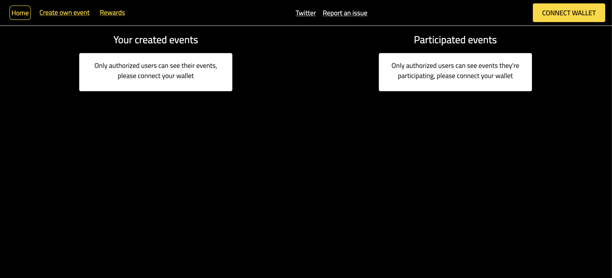
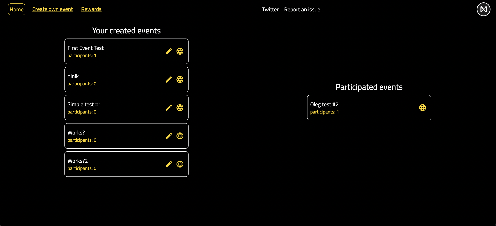
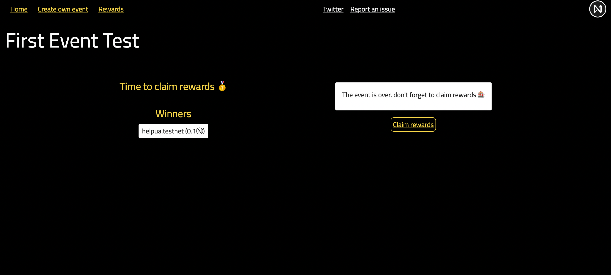

# Raffler Application

Demo link - https://raffler-app-fbq88.ondigitalocean.app

Raffler - the application for holding events with rewards, the key feature of it is to help creators/bloggers/communities to engage with their audience
At this step, only prizes in Near are available, next step is to add NFT/FT prizes which is much more interesting for artists

Built with NEAR, Next.js and Rust, for the Near Certified Developer program





# Front-end

Tech stack:

- Next.js
- Material UI
- near-api-js

Functionalities:

- Connect wallet
- Create an event with Near prizes
- Configure doors open/close and prizes for your own events
- Participate in other events & win rewards
- Check the list of created and participated in by you events (with pagination)
- See the list of rewards & claim them

How to run the app locally:

- you need Node.js ≥ 16 installed (https://nodejs.org)
- install the dependencies by running it locally:
  ```
  cd ui
  yarn install
  yarn build
  yarn start
  ```

# Contract

Tech stack:

- Rust
- Near SDK (near-sdk-rs)

Data storage:

- Incremental integer which is needed to set unique IDs for events
- Map of events are stored in a `LookupMap` object
- List of event IDS created by someone's account is stored in a `UnorderedSet` and accessible through `LookupMap` object by account_id
- List of event IDS participated in by someone's account is stored in a `UnorderedSet` and accessible through `LookupMap` object by account_id
- List of rewards metadata by someone's account is stored in a `UnorderedSet` and accessible through `LookupMap` object by account_id

Change methods:

- `new` - initialization
- `add_event` - create a new event
- `set_event_time` - change doors open/close time for event
- `add_near_prize` - deposit Near prize (must be at least 1, max 5)
- `set_event_visible` - make the event visible for anyone, so they can participate
- `join_event` - register (participate) in the event
- `raffle_event_prizes` - randomly select winners & add rewards to their list after the event is over [owner only method]
- `claim_prize` - get your Near prize to account

View methods:

- `get_owner_events` - get a list of events created by provided account_id with pagination
- `get_participant_events` - get a list of events participated in by provided account_id with pagination
- `get_event` - get a single event by id
- `get_account_unclaimed_prizes` - get a list of still unclaimed rewards by provided account_id with pagination
- `is_user_joined_event` - returns whether the account is participating in event or not

How to build and deploy the contract:

```
cd contract
rustup target add wasm32-unknown-unknown
./build.sh
near deploy --accountId=${CONTRACT_ACCOUNT_ID} --wasmFile=out/main.wasm
```
